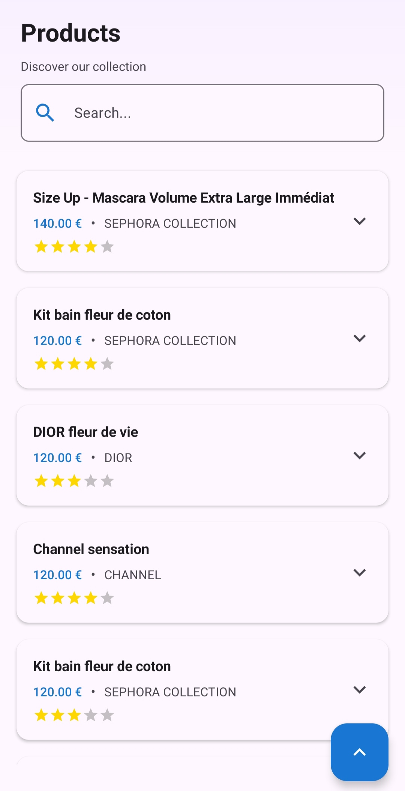
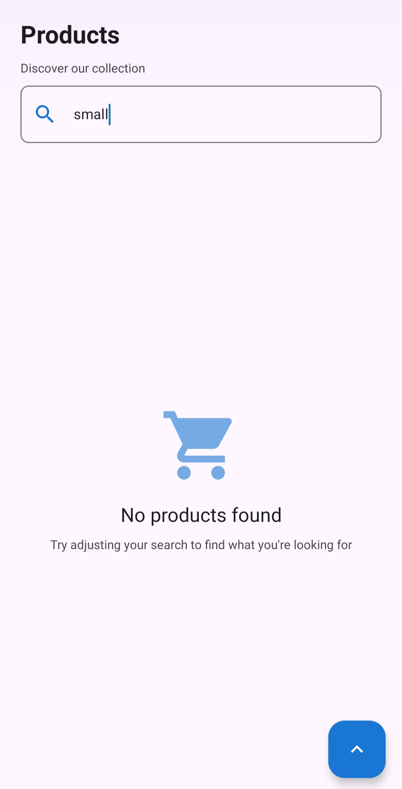
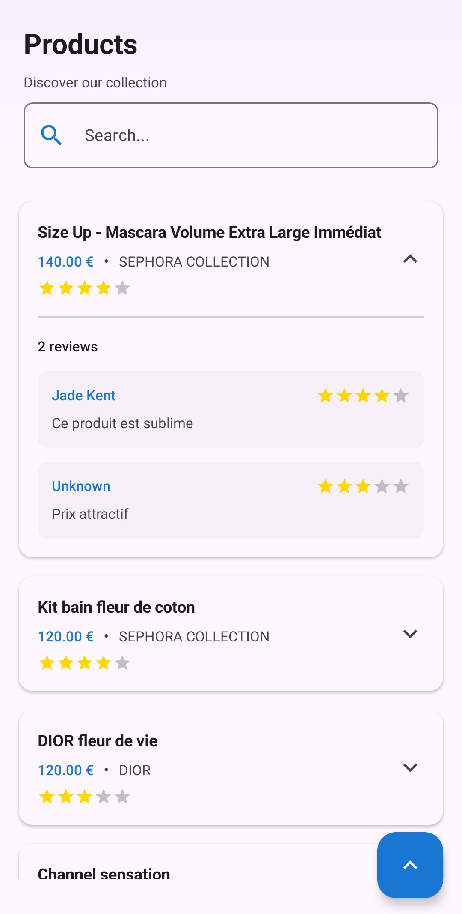

# Seph - Product Reviews App

A modern Android application built with Jetpack Compose that displays products and their reviews
from an API. The app follows Clean Architecture principles and implements the MVVM pattern
with reactive state management.

## 📱 Screenshots

<table>
  <tr>
    <td></td>
    <td></td>
    <td></td>
  </tr>
</table>


The app features a clean, modern UI with:

- Product listing with expandable reviews
- Search functionality
- Global reviews sorting (Best to Worst / Worst to Best)
- Loading and empty states

## 🏗️ Architecture

The project follows **Clean Architecture** with clear separation of concerns:

```
app/
├── core/                          # Shared utilities and theme
│   ├── theme/                     # Material 3 theming (Colors, Typography)
│   ├── util/                      # Result wrapper for API responses
│   └── Constants.kt               # App-wide constants (BASE_URL)
│
└── features/
    └── products/
        ├── data/                  # Data Layer
        │   ├── datasources/       # Remote data sources
        │   ├── dto/               # Data Transfer Objects
        │   ├── mappers/           # DTO to Domain mappers
        │   ├── repositories/      # Repository implementations
        │   └── ProductsApi.kt     # Retrofit API interface
        │
        ├── di/                    # Dependency Injection
        │   ├── NetworkModule.kt   # Retrofit, OkHttp, Gson providers
        │   ├── RepositoryModule.kt
        │   └── UseCaseModule.kt
        │
        ├── domain/                # Domain Layer
        │   ├── entities/          # Business models (Product, Review)
        │   ├── repositories/      # Repository interfaces
        │   └── usecases/          # Business logic (GetProducts, GetReviews)
        │
        └── presentation/          # Presentation Layer
            ├── components/        # Reusable Compose components
            ├── mappers/           # Domain to UI mappers
            ├── models/            # UI models
            ├── ProductsScreen.kt  # Main screen composable
            ├── ProductsUiState.kt # UI state data class
            └── ProductsViewModel.kt
```

## 🛠️ Tech Stack

### Core

| Technology            | Version | Purpose              |
|-----------------------|---------|----------------------|
| Kotlin                | 2.0.21  | Programming language |
| Android Gradle Plugin | 8.13.2  | Build system         |
| Min SDK               | 24      | Android 7.0+         |
| Target SDK            | 36      | Latest Android       |

### UI

| Library            | Purpose                  |
|--------------------|--------------------------|
| Jetpack Compose    | Declarative UI framework |
| Material 3         | Design system            |


### Architecture & DI

| Library    | Purpose                  |
|------------|--------------------------|
| Hilt       | Dependency injection     |
| ViewModel  | State management         |
| StateFlow  | Reactive state           |
| Coroutines | Asynchronous programming |

### Networking

| Library  | Purpose                  |
|----------|--------------------------|
| Retrofit | REST client              |
| OkHttp   | HTTP client with caching |
| Gson     | JSON serialization       |

### Testing

| Library  | Purpose                |
|----------|------------------------|
| JUnit 4  | Unit testing framework |
| MockK    | Kotlin mocking library |
| Turbine  | Flow testing           |

## ✨ Features

### Product Listing

- Displays products fetched from remote API
- Shows product name, brand, and price


### Reviews System

- Expandable reviews section for each product
- Tap on a product to toggle reviews visibility
- Star rating display based on rating value
- Reviews sorted by rating (Best to Worst by default)

### Search

- Local search with debounce (300ms)
- Filters products by name
- Search as you type

### Sorting

- Floating Action Button for global reviews sorting
- Two options: Best2Worst and Worst2Best
- Applies to all product reviews simultaneously

### State Management

- Loading state with visual indicator
- Empty state when no products match search

## 🚀 Getting Started

### Prerequisites

- Android Studio Hedgehog (2023.1.1) or newer
- JDK 17
- Android SDK with API 36

### Installation

1. **Clone the repository**
   ```bash
   git clone https://github.com/dombroks/seph.git
   cd seph
   ```

2. **Open in Android Studio**
    - Open Android Studio
    - Select "Open an existing project"
    - Navigate to the cloned directory

3. **Build the project**
   ```bash
   ./gradlew assembleDebug
   ```

4. **Run on device/emulator**
   ```bash
   ./gradlew installDebug
   ```

### Running Tests

```bash
# Unit tests
./gradlew test

# Instrumented tests
./gradlew connectedAndroidTest
```

## 📡 API

The app fetches data from Sephora's test API:

**Base URL:** `https://sephoraandroid.github.io/testProject/`

### Endpoints

| Endpoint            | Description              |
|---------------------|--------------------------|
| `GET /items.json`   | Fetches list of products |
| `GET /reviews.json` | Fetches product reviews  |

### Product Response

```json
{
  "product_id": 123,
  "product_name": "Product Name",
  "description": "Product description",
  "price": 29.99,
  "images_url": {
    "small": "https://...",
    "large": "https://..."
  },
  "c_brand": {
    "id": "brand_id",
    "name": "Brand Name"
  },
  "is_productSet": false,
  "is_special_brand": true
}
```

### Reviews Response

```json
{
  "product_id": 123,
  "hide": false,
  "reviews": [
    {
      "name": "Reviewer Name",
      "text": "Review text",
      "rating": 4.5
    }
  ]
}
```

## 🎨 Theming

The app uses Material 3 with a blue color scheme:

### Light Theme

- Primary: `#1976D2` (Blue 40)
- Secondary: `#546E7A` (Blue Grey 40)
- Tertiary: `#0288D1` (Light Blue 40)

### Dark Theme

- Primary: `#82B1FF` (Blue 80)
- Secondary: `#B0BEC5` (Blue Grey 80)
- Tertiary: `#80D8FF` (Light Blue 80)

### Accent Colors

- Star Rating: `#FFD700` (Gold)

## 📂 Key Components

### ProductsViewModel

Manages UI state and business logic:

- Loads products and reviews on initialization
- Handles search with debounce using Flow
- Manages reviews visibility toggle
- Implements global reviews sorting

### ProductsUiState

```kotlin
data class ProductsUiState(
    val productsWithReviews: List<ProductWithReviewsUi> = emptyList(),
    val searchInput: String = "",
    val isLoading: Boolean = false,
    val errorMessage: String? = null,
    val reviewsSortOption: ReviewsSortOption = ReviewsSortOption.Best2Worst
)
```

### Result Wrapper

Generic sealed interface for handling API responses:

```kotlin
sealed interface Result<out T> {
    data class Success<T>(val data: T) : Result<T>
    data class Error(val exception: Throwable) : Result<Nothing>
    data object Loading : Result<Nothing>
}
```

## 📝 Code Quality

- **Kotlin Coding Conventions** followed throughout
- **Clean Architecture** for maintainability
- **Single Responsibility Principle** in all layers
- **Dependency Injection** for testability
- **Immutable State** management with data classes

## 🤝 Contributing

1. Fork the repository
2. Create a feature branch (`git checkout -b feature/amazing-feature`)
3. Commit your changes (`git commit -m 'Add amazing feature'`)
4. Push to the branch (`git push origin feature/amazing-feature`)
5. Open a Pull Request


## 👤 Author

**Younes Belouche**

- GitHub: [@dombroks](https://github.com/dombroks/)

---

Made with ❤️ using Jetpack Compose

